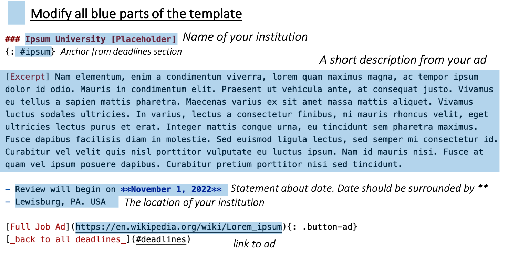
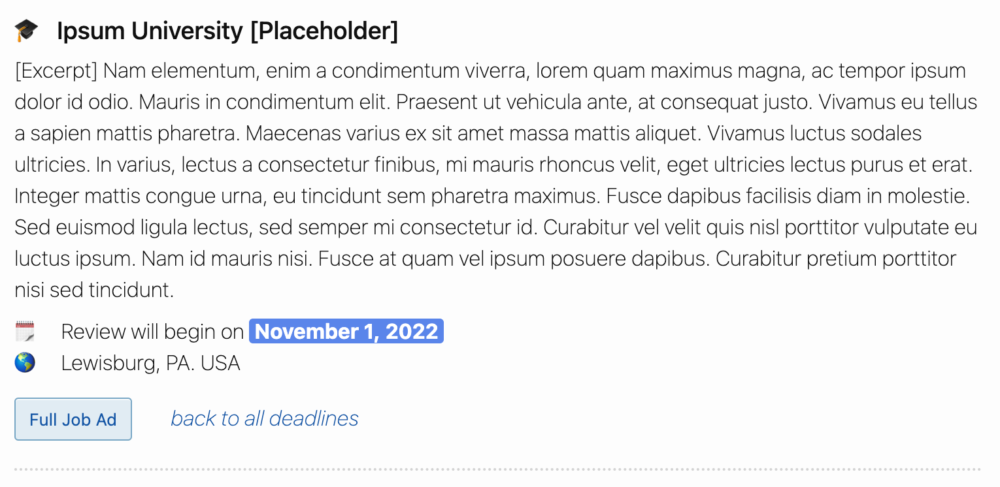

<link rel="stylesheet" href="cspui.css">

<!-- ## Adding your position to CS-PUI (2022/23) -->

**📢 cs-pui jobs is currently under construction 📢** The website is currently under development. We appreciate your patience!
{: .notice .notice-red}

💡 You can email `jcrouser@smith.edu` if you run into any problems or need help.
{: .notice .notice-blue}

While we often post positions quickly after they are publicized, departments can also add their own advertisements to the site. **Make sure your department and university aligns with the website criteria**. [See the criteria](index#criteria)

There are two options: 
1. You can add your information by **editing our Github repository** (and eventually creating a pull request). _Follow the instructions on the page below._
2. Or if you're uncomfortable about making changes here, you can email `jcrouser@smith.edu` and Jordan will happily post your ad for you. 

------------
### Adding your position via Github
This is the preferred way for you to add positions because it gives you full control. 


💡 **Don't worry about breaking things.** If you're a little worried about messing up the website accidentally, _don't_! We have to approve all additions before they go live (that's how pull requests on Github work), and try to double-check all additions. 
{: .notice .notice-blue}


1. Edit [`deadlines.md`](https://github.com/cs-pui/cs-pui.github.io/blob/master/_includes/deadlines.md) with your app deadline, anchor link, and location (instructions below)
2. Edit [`descriptions.md`](https://github.com/cs-pui/cs-pui.github.io/blob/master/_includes/descriptions.md) with an excerpt from your ad, location, link, and deadline (instructions below)

----------------

#### ✅ 1. Add your deadline

👉 Edit the [`deadlines.md` file](https://github.com/cs-pui/cs-pui.github.io/blob/master/_includes/deadlines.md) linked here. 

The [table presented on the front page](/#deadlines) is represented in markdown in the following format: 

```markdown
| **Institution** | **Location** | **App Deadline** |
| :----       | :---       | :--- |
| [Lorem College](#lorem)   | Arpinum, Italy | 09/01/2022 |
| [Me University](#me)      | Center of the universe, USA | 10/15/2022 (open until filled) |
| [Ipsum University](#ipsum) | Lewisburg, PA  | 11/01/2022 |
```

_add your institution, preferred anchor name, location, and date_ to the table, keeping the table sorted such that earlier dates are on top. 

**Example 1**: If you wanted to add `Bucknell University` with an app date of `10/16/2022`, the table should look like this: 

```markdown
| **Institution** | **Location** | **App Deadline** |
| :----       | :---       | :--- |
| [Lorem College](#lorem)   | Arpinum, Italy | 09/01/2022 |
| [Me University](#me)      | Center of the universe, USA | 10/15/2022 (open until filled) |
| [Bucknell University](#bucknell) | Lewisburg, PA | 10/16/2022 |
| [Ipsum University](#ipsum) | Lewisburg, PA  | 11/01/2022 |
```

**Example 2**: Forthcoming ads should be placed at the bottom of the list. So if I wanted to create a forthcoming adverstisement for Hogwarts, it would look like this: 

```markdown
| **Institution** | **Location** | **App Deadline** |
| :----       | :---       | :--- |
| [Lorem College](#lorem)   | Arpinum, Italy | 09/01/2022 |
| [Me University](#me)      | Center of the universe, USA | 10/15/2022 (open until filled) |
| [Bucknell University](#bucknell) | Lewisburg, PA | 10/16/2022 |
| [Ipsum University](#ipsum) | Lewisburg, PA  | 11/01/2022 |
| [Hogwarts School of Witchcraft and Wizardry](#hogwarts) | Scotland Highlands | forthcoming |
```

----------------

#### ✅ 2. Add your description 

👉 Edit the [`descriptions.md`](https://github.com/cs-pui/cs-pui.github.io/blob/master/_includes/descriptions.md) file linked here

Given the following template, modify it with your advertisement's information (see [worked example below](#desc-example)), and then copy-paste it into [`descriptions.md`](https://github.com/cs-pui/cs-pui.github.io/blob/master/_includes/descriptions.md), making sure that it is in correct alphabetical order with respect to other institutions. 

```markdown
### University Name
{: #university-anchor}

[Excerpt] This is where you add a paragraph from your job ad. 

- 1st bullet should be about your app deadline. **date in bold**
- 2nd bullet should include your location

[Full Job Posting](https://this-should-be-the-link-to-your-ad.edu){: .button-job} 
[_back to all deadlines_](#deadlines)

------------
```


🚨 **The spacing and ordering is important for a correct CSS interpretation**. For example:
-  the `**` bold markers in the 1st bullet point will style your date with a blue box. 
- Keep no line spacing between the `Full Job Posting` and `_back to all deadlines_`. This will ensure the buttons are next to each other (see example below)

<div class="notice notice-red">{{ formatting | markdownify }}</div>


If you would like to add a _forthcoming position_, just leave out most of the information like this: 

```markdown
### University Name
{: #university-anchor}

[Excerpt] Ad is forthcoming

- Ad is forthcoming - TBA
- 2nd bullet should include your location

[_back to all deadlines_](#deadlines)

------------
```


--------- 

#### _Example: Ipsum University_
{: #desc-example}

An example of modifying the template above to include information about a fictional _Ipsum University_





If done correctly, the text above should be automatically formatted and translatted as the following on the cs-pui website...


